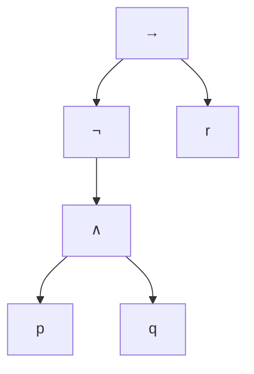
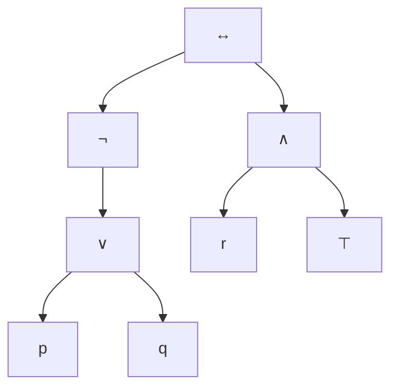

# Matemáticas Discretas 1
## Clase 1: Fundamentos y Alfabeto Lógico 🧠

Un recorrido desde la abstracción del lenguaje hasta la estructura matemática.

---
layout: two-cols
---

# 1. ¿Qué es la Lógica Formal?

Es la ciencia que estudia la **validez** de los argumentos desde su estructura, sin importar el contenido.

### En Computación:
- **Verificación de Software:** ¿El código hace lo que dice la especificación?
- **Sistemas Expertos:** Motores de inferencia que "razonan" como humanos.
- **Optimización:** Reducir expresiones lógicas para gastar menos CPU/Energía.

::right::

### El Principio de Identidad
Una proposición es idéntica a sí misma:
$p \equiv p$

### El Principio de No Contradicción
Es imposible que una proposición sea verdadera y falsa al mismo tiempo:
$\neg(p \wedge \neg p)$

### El Principio del Tercero Excluido
O es verdad o es mentira, no hay tintes grises:
$p \vee \neg p$

---
---
layout: section
---

# Profundizando en el Concepto de Proposición
### Del lenguaje cotidiano a la estructura matemática

---
layout: default
---

# 1. El Valor de Verdad y el Principio de Bivalencia

Para que una entidad lingüística sea **proposición**, debe someterse al **Principio de Bivalencia**.

### La naturaleza del valor de verdad
No importa si conocemos la respuesta *ahora*, importa que la respuesta exista de forma única en el universo de discurso.

* **Valores posibles:** $\{V, F\}$ o $\{1, 0\}$.
* **Caso "Mañana lloverá":** Es una proposición porque, aunque es una incertidumbre temporal, en el futuro el evento se realizará o no. No hay una tercera opción (Tercero Excluido).
* **Caso de paradojas:** "Esta frase es falsa". No es proposición porque si es $V$ entonces es $F$, y si es $F$ entonces es $V$. Rompe el principio de no contradicción.

---
layout: two-cols
---

# 2. Enunciados Abiertos vs. Cerrados

Un enunciado abierto (o función proposicional) contiene **variables libres**.

### El problema de la variable $x$
En $x + 2 = 5$, el símbolo $x$ es un marcador de posición. 
- No tiene valor de verdad hasta que se define un **dominio** y un **valor**.

### ¿Cómo convertirlos en proposiciones?
1. **Asignación:** Si $x = 3$, entonces $3 + 2 = 5$ ✅ ($V$).
2. **Cuantificación:** "Existe un $x$ tal que $x + 2 = 5$". 
   $$\exists x \in \mathbb{R} : x + 2 = 5$$

::right::

### Clasificación técnica:
- **Enunciado:** "Él es un lenguaje de programación". (❌ Variable libre: "Él").
- **Proposición:** "Python es un lenguaje de programación". (✅ Valor asignado).

> **Regla de oro:** Si la oración te hace preguntar "¿Quién?" o "¿Cuánto vale la variable?", no es proposición.

---

# 3. Tipos de Enunciados No Proposicionales

La lógica formal ignora las funciones del lenguaje que no sean **informativas**.

| Tipo | Ejemplo | Por qué falla |
| --- | --- | --- |
| **Imperativos** | "Limpia tu código." | Expresa una voluntad o mandato, no un hecho. |
| **Interrogativos** | "¿Ya compiló?" | Busca información, no la afirma ni la niega. |
| **Exclamativos** | "¡Qué gran algoritmo!" | Expresa una emoción o juicio subjetivo. |
| **Dubitativos** | "Quizás sea un error de sintaxis." | La duda impide asignar un valor de verdad binario. |

---

# 4. Anatomía de la Proposición Compuesta

Una proposición compuesta es una función donde los argumentos son proposiciones atómicas y el resultado depende de los conectores.

### Proposiciones Atómicas ($p, q$)
Son la unidad mínima de información. No contienen conectores lógicos internos.
- *Ejemplo:* "El servidor es Linux".

### Proposiciones Compuestas (Fórmulas moleculares)
Se construyen mediante el uso de **functores lógicos**. 

$$L = \{p, q, r, \dots, \neg, \wedge, \vee, \rightarrow, \leftrightarrow\}$$

### Ejemplo de profundidad en Computación:
> "Si el sensor detecta calor ($p$) y la alarma está activa ($q$), entonces se envía un log ($r$)."

**Estructura lógica:** $(p \wedge q) \rightarrow r$
- Aquí la veracidad de la notificación ($r$) depende estrictamente del estado de verdad de la conjunción de los sensores.

---
layout: center
class: text-center
---

# Resumen de Verificación
### ¿Es Proposición? Checklist:

1. ¿Es una oración declarativa?
2. ¿Se le puede asignar $V$ o $F$ sin ambigüedad?
3. ¿Carece de variables libres sin definir?
4. ¿Es objetiva respecto a su valor de verdad?

---

---

---

# 3. El Lenguaje Formal $\mathcal{L}$
### Alfabeto, Gramática y Fórmulas Bien Formadas (WFF)

---
layout: default
---

# 3.1 El Alfabeto de la Lógica Proposicional

Para eliminar la ambigüedad del lenguaje natural, definimos un conjunto estrictamente limitado de símbolos $\Sigma$.

### A. Símbolos Lógicos
* **Variables Proposicionales ($\mathcal{P}$):** Letras minúsculas $\{p, q, r, s, \dots\}$ que representan unidades mínimas de información (átomos).
* **Constantes de Verdad:** * $\top$ (Verdad / *Top* / 1): Representa una tautología absoluta.
    * $\bot$ (Falsedad / *Bottom* / 0): Representa una contradicción absoluta.
* **Conectivos (Operadores):** $\{\neg, \wedge, \vee, \rightarrow, \leftrightarrow\}$.

### B. Símbolos Auxiliares
* **Signos de puntuación:** Paréntesis $(, )$ y corchetes $[, ]$.
* **Función:** Establecer el **alcance** (*scope*) de los conectivos y evitar colisiones sintácticas.

---

# 3.2 Fórmulas Bien Formadas (WFF)

Una **WFF** (*Well-Formed Formula*) es una cadena de símbolos que "compila" según las reglas gramaticales. Se define mediante una **inducción estructural**:

1.  **Base:** Toda variable proposicional $p \in \mathcal{P}$ es una WFF.
2.  **Paso Inductivo (Unario):** Si $A$ es una WFF, entonces $(\neg A)$ es una WFF.
3.  **Paso Inductivo (Binario):** Si $A$ y $B$ son WFF, entonces:
    * $(A \wedge B)$, $(A \vee B)$, $(A \rightarrow B)$ y $(A \leftrightarrow B)$ son WFF.
4.  **Clausura:** Una cadena es una WFF **si y solo si** puede ser generada mediante un número finito de aplicaciones de las reglas 1, 2 y 3.

---

# 3.3 Jerarquía de Operadores (Precedencia)

En la práctica, omitimos paréntesis externos siguiendo un orden de prioridad matemática (de mayor a menor fuerza):

| Orden | Operador | Nombre | Alcance |
| :--- | :---: | :--- | :--- |
| **1°** | $\neg$ | Negación | El literal inmediato a la derecha. |
| **2°** | $\wedge$ | Conjunción | Une los operandos más cercanos. |
| **3°** | $\vee$ | Disyunción | Igual nivel que la conjunción. |
| **4°** | $\rightarrow$ | Condicional | Define la estructura principal. |
| **5°** | $\leftrightarrow$ | Bicondicional | El conector de menor jerarquía. |

> **Regla de Oro:** En caso de operadores con igual jerarquía (como $\wedge$ y $\vee$), la evaluación se realiza de **izquierda a derecha**.

---
layout: two-cols
---

# 3.4 Análisis y Parsing

Para verificar si una fórmula es "legal", los sistemas informáticos generan un **Árbol de Sintaxis Abstracta (AST)**.

**Fórmula de ejemplo:**
$$\neg(p \wedge q) \rightarrow r$$

1.  El nodo raíz es el operador de menor jerarquía ($\rightarrow$).
2.  Las hojas son los átomos ($p, q, r$).
3.  Los nodos internos son las operaciones intermedias.

::right::

---
layout: default
---

# 3.5 Verificación de Sintaxis (Logical Debugging)

Para que una cadena de símbolos sea procesable, debe ser una **WFF**. Analicemos casos reales de "errores de compilación" lógica y cómo corregirlos.

### 🔍 Casos de Estudio: ¿WFF o basura sintáctica?

| Cadena de Símbolos | ¿Es WFF? | Diagnóstico del "Compilador" Lógico |
| :--- | :---: | :--- |
| $p \rightarrow (q \wedge r)$ | ✅ | **Correcto.** Estructura binaria bien definida y balanceada. |
| $p \neg q$ | ❌ | **Error de Operador.** La negación es unaria y prefija ($\neg q$). Falta conector binario. |
| $p \wedge \vee q$ | ❌ | **Conflicto de Aridad.** Dos conectores binarios seguidos sin un operando intermedio. |
| $(\neg p \wedge q$ | ❌ | **Parentización Incompleta.** Falta el cierre del alcance (Scope error). |
| $\neg \neg \neg p$ | ✅ | **Recursión Válida.** Aplicación sucesiva de la regla unaria. Equivalente a $\neg p$. |

---

### 🌳 El Árbol de Derivación (Backtracking)

Una forma infalible de verificar una WFF es intentar construir su árbol de arriba hacia abajo. Si queda un "hilo suelto", la fórmula es inválida.

**Ejemplo de análisis para:** $\neg(p \vee q) \leftrightarrow (r \wedge \top)$

1. **Conector Principal:** $\leftrightarrow$ (Divide la fórmula en dos sub-WFF).
2. **Rama Izquierda:** Una negación que afecta a una disyunción $(p \vee q)$.
3. **Rama Derecha:** Una conjunción entre una variable $r$ y una constante $\top$.

---

# 4. Operadores Lógicos (Análisis Profundo)

### A. La Negación ($\neg$) - Unario
Invierte el valor de verdad.
- **Teoría:** Si $v(p) = V$, entonces $v(\neg p) = F$.
- **Ejemplo:** $p$: "El puerto 80 está abierto". $\neg p$: "El puerto 80 **no** está abierto".

### B. La Conjunción ($\wedge$) - Binario
Es el "Y" lógico. Solo es verdadero si **ambos** componentes lo son.
- **Fórmula:** $v(p \wedge q) = V \iff v(p) = V \text{ y } v(q) = V$.
- **Uso en código:** `if (user.is_active && user.has_token)`

### C. La Disyunción ($\vee$) - Binario
Es el "O" inclusivo. Es falso **únicamente** si ambos son falsos.
- **Fórmula:** $v(p \vee q) = F \iff v(p) = F \text{ y } v(q) = F$.
- **Nota:** Si ambos son verdaderos, la disyunción sigue siendo verdadera.

---

# 5. Tablas de Verdad de Referencia

| $p$ | $q$ | $\neg p$ | $p \wedge q$ | $p \vee q$ |
| :---: | :---: | :---: | :---: | :---: |
| $V$ | $V$ | $F$ | **$V$** | $V$ |
| $V$ | $F$ | $F$ | $F$ | $V$ |
| $F$ | $V$ | $V$ | $F$ | $V$ |
| $F$ | $F$ | $V$ | $F$ | **$F$** |

### Análisis de combinaciones:
Para $n$ variables, el número de combinaciones posibles es:
$$2^n$$
*Si tenemos $p, q, r, s$, necesitaremos $2^4 = 16$ filas.*

---

# 6. Formalización: Del Español a la Matemática

Traducir requiere detectar palabras clave (pistas):

> "No es cierto que el servidor esté caído y la base de datos no responda."

### Paso 1: Definir Diccionario
- $p$: "El servidor está caído".
- $q$: "La base de datos responde".

### Paso 2: Detectar Conectores
- "No es cierto que..." $\rightarrow \neg(\dots)$ (Afecta a todo el bloque)
- "... y ..." $\rightarrow \wedge$
- "... no responda" $\rightarrow \neg q$

### Paso 3: Construir Fórmula
$$\neg(p \wedge \neg q)$$

---
layout: center
---

# Ejercicios de Práctica

1. **Formaliza:** "Hoy no es lunes o el examen es difícil, pero aprobaremos".
2. **Determina:** Si $p$ es $V$ y $q$ es $F$, ¿cuál es el valor de $\neg(\neg p \vee q)$?
3. **Reflexiona:** ¿Por qué en programación se usa `||` para la disyunción?

---